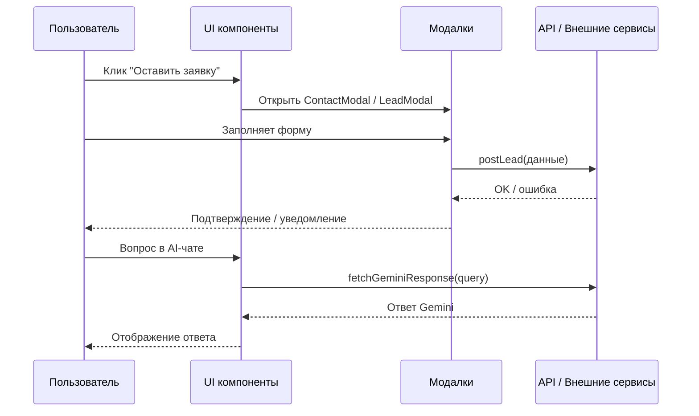
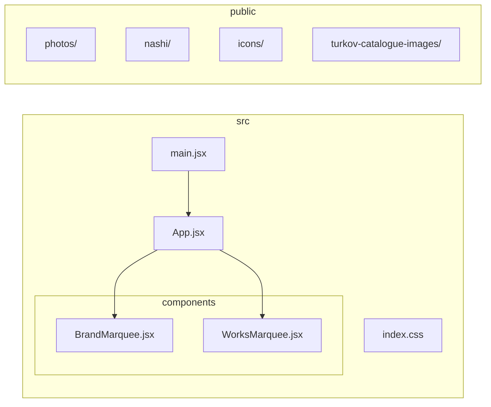

Установите расширение Mermaid в Cursor# Архитектура проекта Воздух НСК

## 1. Общая структура приложения

```mermaid
flowchart TB
    subgraph Entry["Точка входа"]
        main["main.jsx"]
        indexCSS["index.css"]
    end

    subgraph App["App.jsx — Корень"]
        AppRoot["App()"]
        MainSite["MainSite()"]
    end

    subgraph Data["Данные (константы)"]
        complexSolutions["complexSolutions — решения по сегментам"]
        turkovCategories["turkovCategories — TURKOV каталог"]
        ventPresets["VENT_PRESETS, AC_PRESETS"]
        works["WORKS"]
        articles["ARTICLES"]
        serviceInfo["SERVICE_INFO"]
    end

    subgraph Services["Сервисы / API"]
        postLead["postLead() — отправка заявок"]
        fetchGemini["fetchGeminiResponse() — AI-чат"]
    end

    subgraph Modals["Модальные окна"]
        ContactModal
        LeadModal
        SolutionDetailModal
        TurkovCategoryModal
        QuickCalcModal
        ArticleModal
        ServiceInfoModal
        BriefGeneratorModal
        PartnerModal
    end

    subgraph Sections["Секции страницы"]
        Navbar
        Hero
        TurkovPromo
        Catalog
        EngineeringSection
        PartnersSection
        Services
        ContactForm
        Footer
    end

    subgraph Components["Компоненты"]
        BrandMarquee["BrandMarquee — бренды"]
        WorksMarquee["WorksMarquee — работы"]
        ClimateAssistant["ClimateAssistant — AI-помощник"]
    end

    main --> AppRoot
    AppRoot --> MainSite
    MainSite --> Navbar
    MainSite --> Hero
    MainSite --> TurkovPromo
    MainSite --> Catalog
    MainSite --> EngineeringSection
    MainSite --> PartnersSection
    MainSite --> Services
    MainSite --> ContactForm
    MainSite --> Footer
    MainSite --> BrandMarquee
    MainSite --> WorksMarquee
    MainSite --> ClimateAssistant
    MainSite --> Modals

    complexSolutions --> Catalog
    turkovCategories --> TurkovPromo
    ventPresets --> QuickCalcModal
    articles --> ArticleModal
    serviceInfo --> ServiceInfoModal

    postLead --> LeadModal
    fetchGemini --> ClimateAssistant
```

## 2. Поток данных и взаимодействий

## 3. Структура файлов

## 4. Секции страницы (порядок сверху вниз)

| # | Секция | Якорь | Описание |
|---|--------|-------|----------|
| 1 | Navbar | — | Шапка, навигация, кнопка «Оставить заявку» |
| 2 | Hero | — | Главный экран с фоном |
| 3 | Catalog | #catalog | Комплексный подход (life/business/industry) |
| 4 | TurkovPromo | #turkov | Каталог TURKOV |
| 5 | BrandMarquee | #manufacturers | Бегущая строка брендов |
| 6 | WorksMarquee | #works | Бегущая строка «Наши работы» |
| 7 | EngineeringSection | #engineering | Инжиниринг |
| 8 | PartnersSection | #partners | Партнёрам |
| 9 | Services | #service | Сервисное обслуживание |
| 10 | ContactForm | #contact | Контакты и форма |
| 12 | Footer | — | Подвал |

## 5. Зависимости

- **React 18** — UI
- **Framer Motion** — анимации
- **Lucide React** — иконки
- **Vite** — сборка
- **Tailwind CSS** — стили
- **Gemini API** — AI-помощник (опционально)
- **Lead API** — приём заявок (VITE_LEAD_API)
